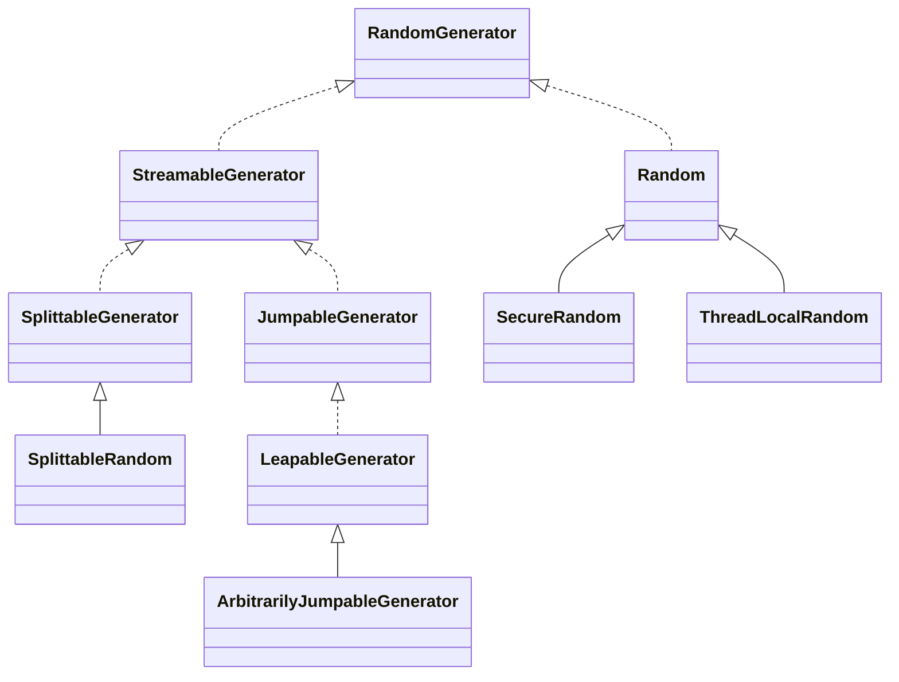

## 요약
공통 인터페이스가 추가되었고, 새로운 PRNG(의사 난수 생성기) 구현으로 LXM 알고리즘이 추가됨 

### 짧은 설명
java 버전이 증가하면서 여러 의사 난수 생성기가 추가 되었으나 인터페이스가 없어서 교체가 어려운 문제가 있었음.
java 17에선 공통 인터페이스가 추가되어, ThreadLocalRandom과 SecureRandom 등을 교체하여 사용 가능해짐.

### 긴 설명
Random (Java 1.0에서 추가됨), SecureRandom (Java 1.1에서 추가됨), ThreadLocalRandom(Java 1.7에서 추가됨), SplittableRandom(Java 1.8)는 동일한 코드가 중복됨에도 서로 다른 클래스로 구현되어있어, 랜덤 생성 알고리즘을 원활히 교체하기 어려웠음.
Java 17에선 RandomGenerator 인터페이스가 추가되었고, 아래처럼 상속구조가 생김

아래처럼 원하는 알고리즘을 선택하여 생성하면 RandomGenerator가 해당하는 클래스로 생성해 줌. (e.g. Xoshiro256PlusPlus -> LeapableGenerator)
``` java
final int seed = 2023;
RandomGenerator randomGenerator = RandomGeneratorFactory.of("Xoshiro256PlusPlus").create(seed);
int output = randomGenerator.nextInt(11);
```
여기서 Xoshiro256PlusPlus 는 랜덤 생성 알고리즘의 이름으로, 만약 이름이 잘못된 경우라면, IllegalArgumentException 발생함.
현재 사용가능한 랜덤 알고리즘의 목록은 아래와 같음.

Legacy 유형: class 로 제공되던 기존 랜덤 클래스
* Random
* SecureRandom
* SplittableRandom

LXM 유형: 기존 SplittableRandom 에서 사용하던 SplitMix 보다 효율적인 알고리즘
  * L32X64MixRandom
  * L32X64StarStarRandom
  * L64X128MixRandom
  * L64X128StarStarRandom
  * L64X256MixRandom
  * L64X1024MixRandom
  * L128X128MixRandom
  * L128X256MixRandom
  * L128X1024MixRandom 
   
Xoshiro 유형, Xoroshiro 유형: XOR/shift/rotate 을 사용한 빠른 랜덤 알고리즘
* Xoshiro256PlusPlus
* Xoroshiro128PlusPlus

LXM과 Xoshiro 유형은 RandomGeneratorFactory로만 생성 가능함. 쓰레드-안전하지 않음. CPRNG 아님.

앞으로도 추가될 예정이므로 위 목록은 바뀔 수 있음. 아래 코드를 사용하여 사용가능한 알고리즘을 출력해볼 수 있음.

``` java
RandomGeneratorFactory.all()
    .map(x -> x.name())
    .sorted()
    .forEach(System.out::println);
```
이 중에서 RandomGeneratorFactory에는 다양한 속성을 가지고 있으므로, 필요한 랜덤 알고리즘만 필터 가능함.
예를 들어, 병렬처리를 위해 splittable 한 라이브러리를 찾는다면, 아래처럼 필터를 걸면 됨.
``` java
RandomGeneratorFactory.all()
    .map(x -> x.name())
    .filter(RandomGeneratorFactory::isSplittable)
    .sorted()
    .forEach(System.out::println);
```

| 알고리즘                  | stateBits  | statistical | stochastic | splittable | streamable | jumpable | leapable | thread-safe |
|-----------------------|------------|-------------|------------|------------|------------|----------|----------|-------------|
| Random                | 48         | O           |            |            |            |          |          | O           |
| SecureRandom          | 2147483647 |             | O          |            |            |          |          | O           |
| SplittableRandom      | 64         | O           |            | O          | O          |          |          |             |
| L32X64MixRandom       | 96         | O           |            | O          | O          |          |          |             |
| L32X64StarStarRandom  | 96         | O           |            | O          | O          |          |          |             |
| L64X128MixRandom      | 192        | O           |            | O          | O          |          |          |             |
| L64X128StarStarRandom | 192        | O           |            | O          | O          |          |          |             |
| L64X256MixRandom      | 320        | O           |            | O          | O          |          |          |             |
| L64X1024MixRandom     | 1088       | O           |            | O          | O          |          |          |             |
| L128X128MixRandom     | 256        | O           |            | O          | O          |          |          |             |
| L128X256MixRandom     | 384        | O           |            | O          | O          |          |          |             |
| L128X1024MixRandom    | 1152       | O           |            | O          | O          |          |          |             |
| Xoroshiro128PlusPlus  | 128        | O           |            |            | O          | O        | O        |             |
| Xoshiro256PlusPlus    | 256        | O           |            |            | O          | O        | O        |             |

* statistical : 통계적으로 어느 정도 유의미.
* stochastic : 시간에 따라 다른 값 생성 가능
* splittable : (f/j 또는 쓰레드풀에서 실행할 때를 위해) generator의 자식을 split 가능
* jummpable, leapable : 미리 정한 횟수(2^64)만큼 추첨을 뛰어넘기 가능. (leapable은 더 많이 뛰어 넘을 수 있다는 뜻)